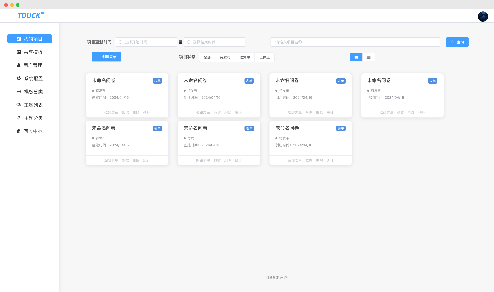
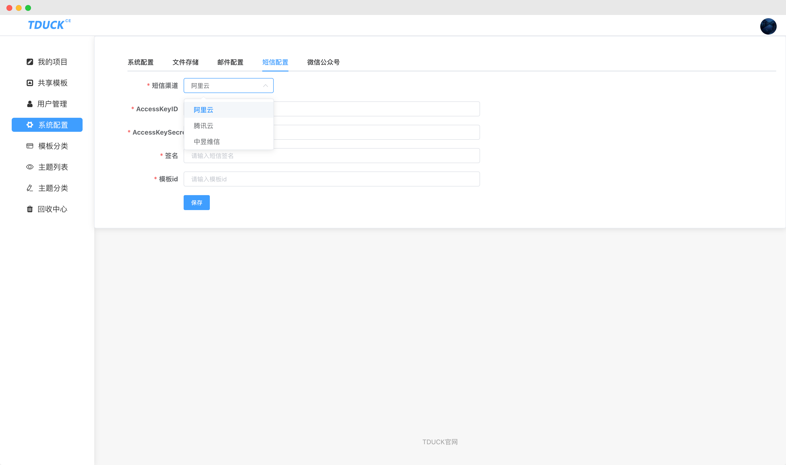

<p align="center">
    </img>
    </img>
    </img>
    </img>
    </img>
    </img>
    <br />
    <br />   
    <a href="https://www.tduckcloud.com/" target="_blank">官方网站</a>&nbsp;
    <a href="https://doc.tduckcloud.com"  target="_blank" >部署文档</a>&nbsp;
    <a href="https://gitee.com/TDuckApp/tduck-platform/issues" target="_blank">用户社区</a>&nbsp;
    <a href="https://space.bilibili.com/409825300" target="_blank">Bilibili频道</a>
</p>

**<p align="center">如果您觉得我们的开源项目有帮助，请点击 :star: Star 支持 TDuck 开源团队:heart:</p>**

---

简体中文 |  [English](./README_en.md)


## 一、关于TDuck

TDuck填鸭表单 是国内首批基于Vue开源的问卷/表单收集工具。

系统采用无代码设计理念，使用者可以通过拖拽的方式创建问卷表单，所见即所得；与此同时也支持专业技术人员自行二次开发自定义组件，来满足企不同企业组织的个性化需求。系统采用SpringBoot+Vue+ElementUI技术栈，无需复杂学习即可快速上手，功能强大UI界面清新，通过简要部署就能够助力企业组织快速赋能业务。

### 功能特性

- 支持 **27+自定义组件** ，拖拽式快速生成表单问卷。
- 支持单行文本、多行文本、日期、下拉、单选、文件上传、排序、级联、轮播、一键定位、手机号验证、矩阵量表、子表单等组件。
- 支持通过文本批量导入表单组件，支持题目显隐逻辑设置。
- 表单数据，支持数据新增、编辑、导出、打印、预览和打包下载附件。
- 表单外观支持头图、背景图、背景颜色、按钮文字等配置。
- 报表支持对问题实时统计分析并以图形（柱状图、折线图、饼图）的形式展示输出和导出png图片。
- 提交后自定义文案、提交后自动跳转网址。
-  **每个微信、账号、ip、设备、答题次数限制、支持设置允许填写时间、记录微信个人信息** 。
- 支持发邮件、微信公众号模板推送提醒。
- 支持 **数据同步Api（全量数据）、数据WebHook推送（可订阅事件：新增、修改、删除）** 。
- 支持保存至模板中心，支持从模板中心选用模板创建表单问卷。
- 用户管理，新增用户、修改用户、删除用户。
- 文件存储自定义配置： **支持阿里云、七牛云、又拍云、本地、通用S3协议上传** 。
- 支持 **邮件、短信（阿里云、腾讯云、中昱维信）、微信公众号参数配置** 。
- 支持回收中心，快速恢复问卷。
- 支持配置[TReport可视化大屏](https://gitee.com/TDuckApp/tduck-report-platform)，高效展示数据

### 在线体验

[TDuck-社区版🌳](https://demo.tduckapp.com) | [TDuckPro-vue2商业版🥈](https://pro.tduckcloud.com) |  [TDuckX-vue3商业版🥇](https://x.tduckcloud.com) 

表单系统有3个版本（社区、Pro、TDuckX），此处绕不清的友友可以看看 [填鸭表单产品能力对比](https://www.tduckcloud.com/doc/x/nSJMvQh6)

所有版本的填鸭表单数据都可以通过WebHook集成至大屏端，实现数据同步：[表单与TReport数据同步教程](https://www.bilibili.com/video/BV1MH4y1K7Xa/)；

---

### 二、社区活动
社区版表单编辑器暂未开源，该模块通过npm引用，不影响使用、二开其他功能。

可以通过给项目助力，获取社区版最新 **表单编辑器源码**！（限时）

活动参与方式：[点击查看](https://doc.tduckcloud.com/openSource/activity.html)

项目发展离不开您的助力，如有帮助请点亮star


---

### 三、项目相关文档
- [填鸭表单生态产品能力对比](https://www.tduckcloud.com/doc/x/nSJMvQh6)
- <a href="https://doc.tduckcloud.com/openSource/deploy/deployforbt.html" target="_blank">使用宝塔一键安装</a>
- [前端项目地址](https://gitee.com/TDuckApp/tduck-front)

- [社区版体验地址](https://demo.tduckapp.com/home)
- [小程序插件（社区版不适用）](https://doc.tduckcloud.com/functionDesc/uniappDesc.html)
---

### 四、项目部署
> - 部署管理员账号：admin@tduckcloud.com
> - 部署默认密码：123456


#### 方式一：使用宝塔面板一键安装 🔥推荐
详细文档：https://doc.tduckcloud.com/openSource/deploy/deployforbt.html


*无技术难度，会安装宝塔面板即可，软件商店选择填鸭表单点击安装即可。

---

#### 方式二：使用docker命令快速启动


```bash
docker run -d \
  --name tduck-platform \
  --restart=always \
  -p 8999:8999 \
  -e SPRING_DATASOURCE_URL="jdbc:mysql://127.0.0.1:3310/tduck-v4?useSSL=false&useUnicode=true&characterEncoding=utf8&serverTimezone=Asia/Shanghai&tinyInt1isBit=false&nullCatalogMeansCurrent=true" \
  -e SPRING_DATASOURCE_USERNAME=root \
  -e SPRING_DATASOURCE_PASSWORD=tduck@tduck \
  -v /upload:/application/BOOT-INF/lib/upload \
  tduckcloud/tduck-platform
```

---

##  📚参数说明

| 参数 | 说明 |
|------|------|
| `--name tduck-platform` | 设置容器名称，便于后续停止/重启管理 |
| `--restart=always` | 容器异常退出时自动重启 |
| `-p 8999:8999` | 将容器内部 8999 端口映射到主机 |
| `-e SPRING_DATASOURCE_URL=...` | 配置 MySQL 数据库连接 URL；注意：如果 MySQL 在宿主机上，请将 <host> 改为 host.docker.internal（Mac/Windows）或宿主机 IP（Linux）。 |
| `-e SPRING_DATASOURCE_USERNAME` | MySQL 用户名 |
| `-e SPRING_DATASOURCE_PASSWORD` | MySQL 密码 |
| `-v /upload:/application/BOOT-INF/lib/upload` | 上传目录挂载，确保宿主机已有该目录 |


> 注意：如果 MySQL 在宿主机上，请将 `<host>` 改为 `host.docker.internal`（Mac/Windows）或宿主机 IP（Linux）。

---

#### 方式三：使用docker-compose 部署环境及项目
```shell
1.先安装docker-compose
2.下载tduck源码
3.进入目录下的docker目录 cd docker，执行命令：docker-compose up
4.运行结束 会自动安装mysql以及tduck程序
```
---

#### 方式四：使用宝塔部署项目
- 部署文档：https://doc.tduckcloud.com/openSource/deploy/openSourceDeploy.html
- 使用指定配置文件：https://doc.tduckcloud.com/openSource/deploy/startByProfile.html

---

#### 方式五：前后端分离部署
- 部署文档：https://doc.tduckcloud.com/openSource/deploy/fenli.html
- 常见问题：https://doc.tduckcloud.com/openSource/deploy/usualQuestion.html
---

### 五、关于问题咨询
- 如果您在使用社区版过程中遇到了问题，可在社区查看常见问题或留言进行求助 - [点击进入填鸭问答社区](https://gitee.com/TDuckApp/tduck-platform/issues)
------------------------------

### 六、预览-社区版 - Preview








### 七、免责声明

近期收到反馈，有用户使用 TDuck 产品从事非法活动，我们特此声明：

- TDuck 始终遵守国家法律法规，倡导合法合规使用产品。
- 未授权任何代理商、经销商、分公司或合作单位，所有销售行为均通过官网或官方渠道进行。
- 若发现非法用途，我们将配合监管部门调查并保留追责权利。
- 所有资源使用均由用户自担风险，我们不对非法行为产生的后果负责。

**请用户合法合规使用 TDuck 产品，共同维护健康、安全的开源环境。**


