<p align="center">
    <a href="https://www.tduckcloud.com" target="_blank" rel="noopener noreferrer">
        
    </a>
</p>

<p align="center">一款在线数据收集/问卷调查工具</p>

<p align="center">
    </img>
    </img>
    </img>
    </img>
    <br />
    <br />   
    <a href="https://www.tduckcloud.com/" target="_blank">官方网站</a>&nbsp;
    <a href="https://doc.tduckcloud.com"  target="_blank" >部署文档</a>&nbsp;
    <a href="https://pro.tduckcloud.com/s/QUiDSKq8" target="_blank">用户社区</a>&nbsp;
    <a href="https://space.bilibili.com/409825300" target="_blank">bilibili频道</a>
</p>


简体中文 |  [English](./README_en.md)

## 项目介绍 - idea

- 2019年初，同事想做一场针对全国范围内的照片数据收集活动，经过考察当时使用了一款saas工具;

- 由于数据量较大，saas工具的部分业务组件、附件存储费用偏高(对我来说)；而且收集的内容隐私性要求高，在当时saas的工具无法满足独立部署。考虑到安全性和费用等问题，我开始规划自己的表单系统。

- 逛了开源社区发现当时国内的开源表单系统比较少，或者说还达不到我们对「美」的追求；于是计划用空余时间写一个问卷表单系统，并从开源做起。```tduck表单```由此诞生。

- 2019年底「COVID-19」的出现，对问卷表单系统的需求又上升一个等级，我们通过不断优化，使企事业单位能够低成本快速拥有一套独立部署的表单问卷系统，即时赋能业务。

- [社区版](https://demo.tduckapp.com) 经过了2年的优化后，功能趋于稳定； 2021年下半年推出了[tduck-Pro版](https://pro.tduckcloud.com)，2023年5月推出<a href="https://pro.tduckcloud.com/s/LNnVStZV" target="_blank">可视化大屏</a>。


### 社区活动 🔥🔥🔥🔥
- 给项目助力，获取社区版最新 **表单编辑器源码**！（限时）
- 活动参与方式：[点击查看](https://doc.tduckcloud.com/openSource/#hot-%E7%A4%BE%E5%8C%BA%E6%B4%BB%E5%8A%A8-%F0%9F%94%A5)
- 项目发展离不开您的助力，如有帮助请点亮star


### 体验及文档
- 查看不同版本的 <a href="http://www.tduckcloud.com" target="_blank">在线体验</a>
- 部署管理员账号：admin@tduckcloud.com
- 部署默认密码：123456
- 部署文档、docker快速启动，请查看 <a href="https://doc.tduckcloud.com" target="_blank">项目文档</a>
- 前端项目地址： https://gitee.com/TDuckApp/tduck-front

### 版本区别
- 功能对比：https://docs.qq.com/sheet/DSUhoR2pOc2RuZ0Va?tab=BB08J2
- 社区版：https://demo.tduckapp.com/home
- Pro版：https://pro.tduckcloud.com
- 小程序插件：https://doc.tduckcloud.com/functionDesc/uniappDesc.html

### 项目部署

#### 使用命令快速启动
```shell
docker run -e SPRING_DATASOURCE_URL="jdbc:mysql://127.0.0.1:3310/tduck-v4?useSSL=false&useUnicode=true&characterEncoding=utf8&serverTimezone=Asia/Shanghai&tinyInt1isBit=false&nullCatalogMeansCurrent=true" -e SPRING_DATASOURCE_USERNAME=root -e SPRING_DATASOURCE_PASSWORD=tduck@tduck -p 8999:8999  -v /upload:/application/BOOT-INF/lib/upload  tduckcloud/tduck-platform
```
#### docker-compose 部署环境及项目
```shell
1.先安装docker-compose
2.下载tduck源码
3.进入目录下的docker目录 cd docker，执行命令：docker-compose up
4.运行结束 会自动安装mysql以及tduck程序
```
#### 使用宝塔部署项目
- 部署文档：https://doc.tduckcloud.com/openSource/deploy/openSourceDeploy.html
- 使用指定配置文件：https://doc.tduckcloud.com/openSource/deploy/startByProfile.html

#### 前后端分离部署
- 部署文档：https://doc.tduckcloud.com/openSource/deploy/fenli.html
- 常见问题：https://doc.tduckcloud.com/openSource/deploy/usualQuestion.html

### 关于问题咨询
- 此项目为Tduck团队兼职维护，如果您在使用社区版过程中遇到了问题，可在社区查看常见问题或留言进行求助 - [点击进入填鸭问答社区](https://support.qq.com/products/389844/)
------------------------------

## 预览-社区版 - Preview

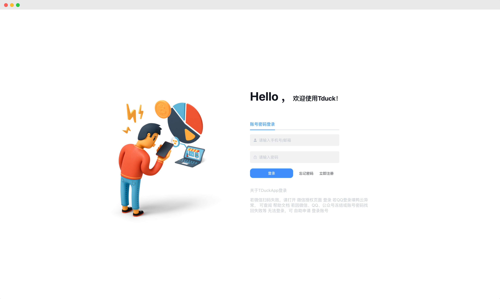
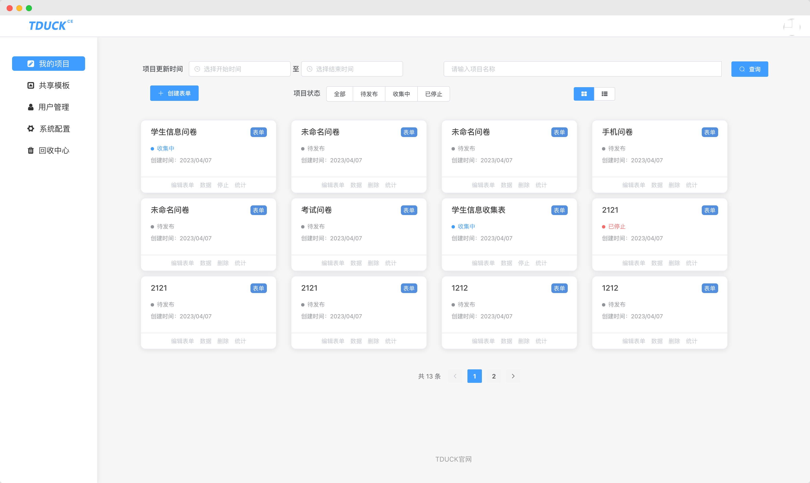

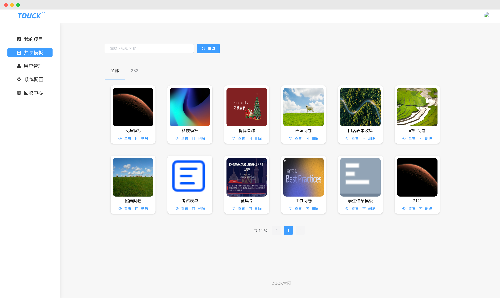
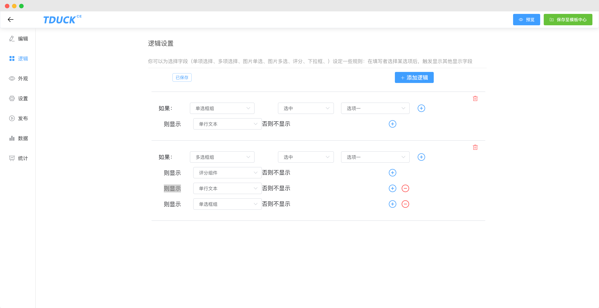
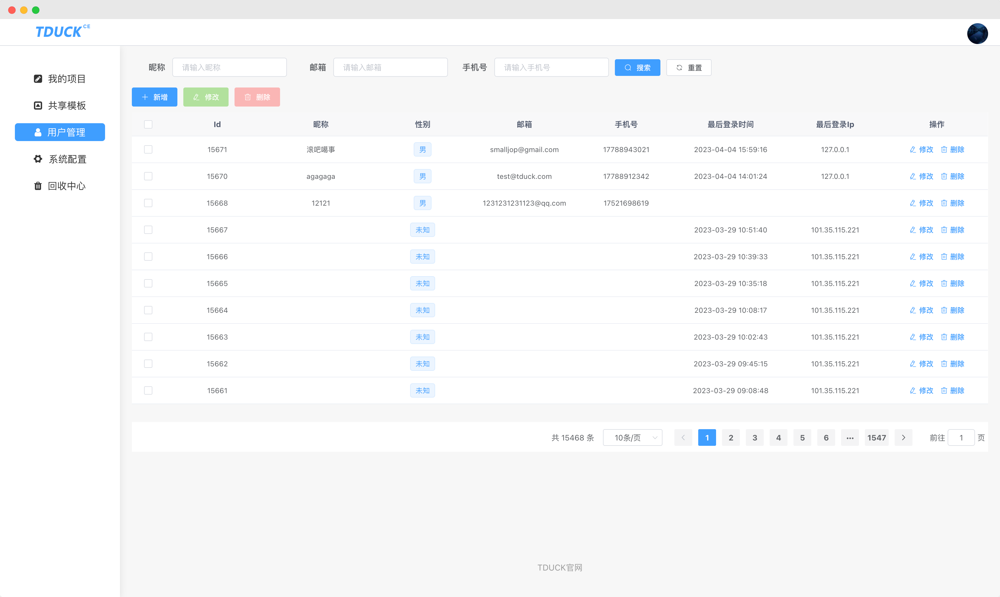
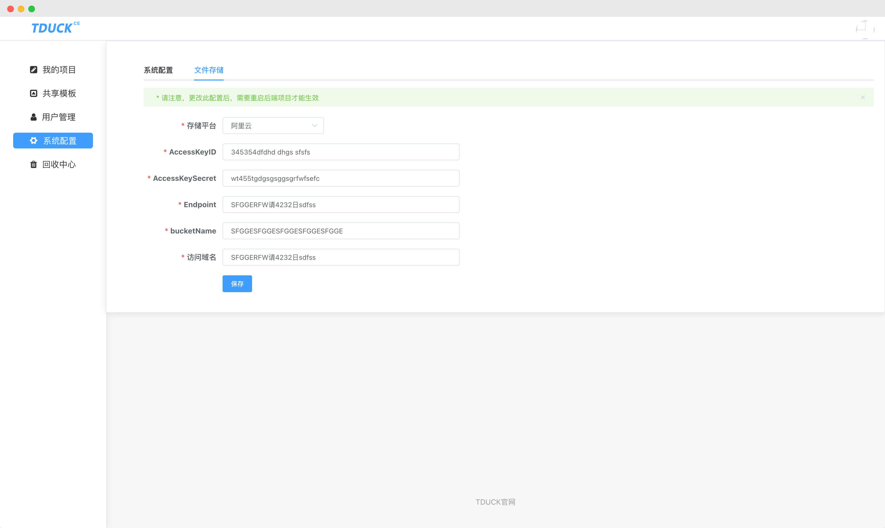
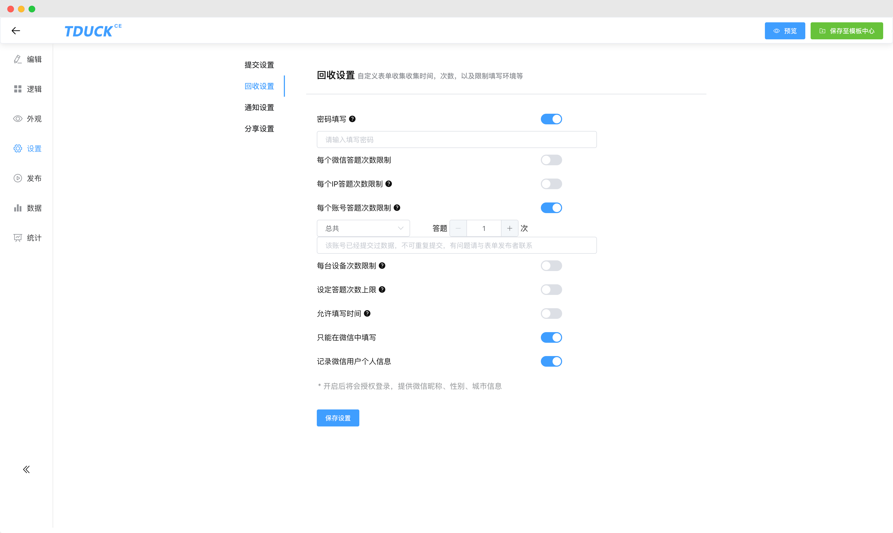
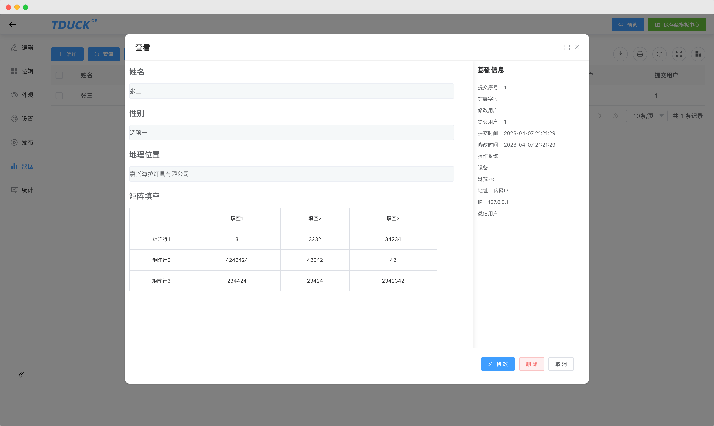
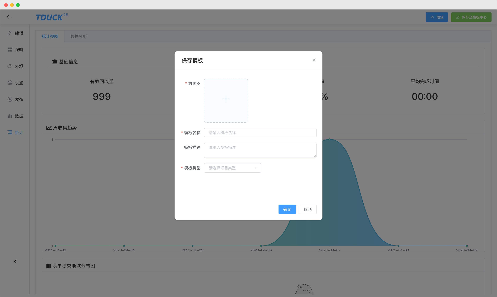
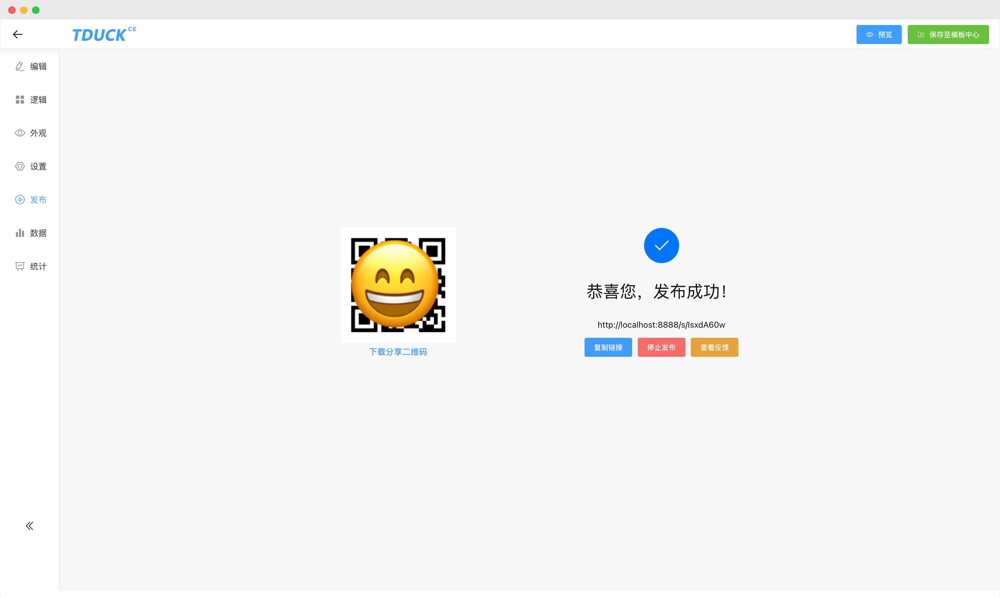
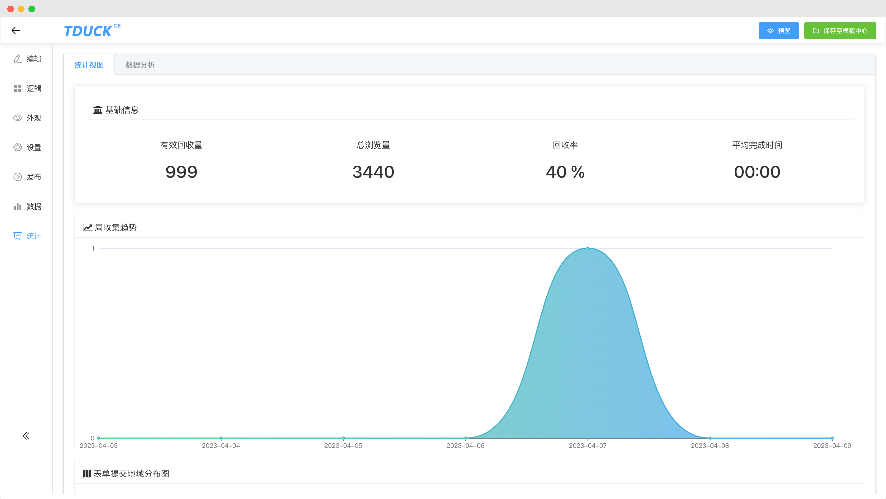
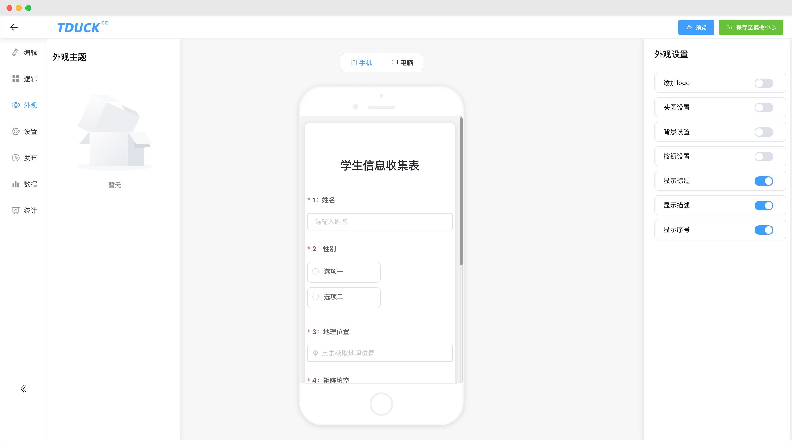


## 免责声明

**近期我们收到了有关单位的反馈，有用户在使用填鸭表单产品从事非法行为**。

TDUCK填鸭表单一直严格遵守国家相关法律法规，致力于确保平台和用户的安全，为用户提供绿色、安全、健康、便捷的工具。 为此，TDUCK特发表以下优化后的免责声明：

TDUCK填鸭表单仅通过官网tduckcloud.com展示产品信息，并提供官网上介绍的销售联系方式进行直接销售。我们没有授权任何分销商，也没有任何分公司、代理商、办事处、经销商等销售TDUCK旗下的产品。

任何用户不得利用TDUCK的产品从事非法行为，必须合法合规地使用产品。如果我们发现客户在使用产品时存在任何非法行为，**我们将会全力配合有关机关进行调查或向政府部门举报**。TDUCK不承担因客户的非法行为而产生的任何法律责任。

TDUCK填鸭表单不提供任何形式的保证。所有与使用本站相关的资源由客户自行承担直接风险。

TDUCK填鸭表单一直坚持合法合规的开发和销售软件产品。我们诚挚地希望所有用户遵守国家法律法规，在合法的前提下使用我们的产品。

特此声明。


